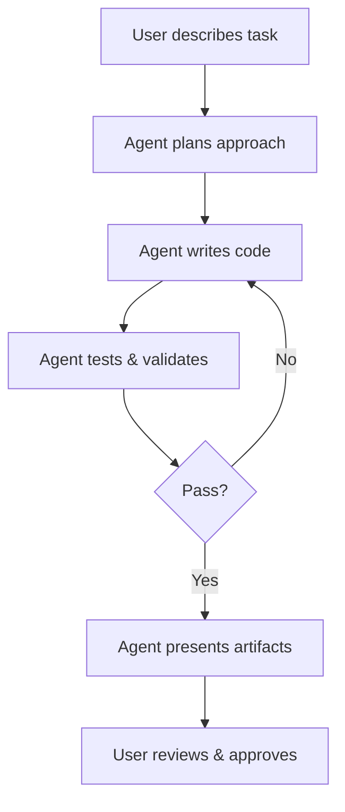

# AI Agents in Google Antigravity

## Agent-First Architecture

Google Antigravity is built around autonomous agents that can independently handle complex development tasks. Users describe what they want, and agents handle the planning, coding, debugging, and verification.

## How Agents Work

## Agent Capabilities

- **Code generation** — Write new files, functions, and modules
- **File editing** — Modify existing code across multiple files
- **Terminal commands** — Run builds, tests, and scripts
- **Browser interaction** — Test UIs, capture screenshots
- **Research** — Search the web for documentation and solutions
- **Planning** — Break complex tasks into manageable steps

## Task Groups

Group related tasks together to manage complex projects. Agents can work on multiple tasks within a group, sharing context and knowledge.

## Multi-Agent Coordination

Multiple agents can work in parallel on different aspects of a project, coordinated by the Agent Manager.

## Providing Feedback

You can guide agents mid-task by:

- Approving or rejecting proposed changes
- Providing additional context or constraints
- Pausing and resuming agent work
- Redirecting approach via feedback

## See Also

- [Features](./features.md) — Complete feature overview
- [Best Practices](./best-practices.md) — Working effectively with agents
