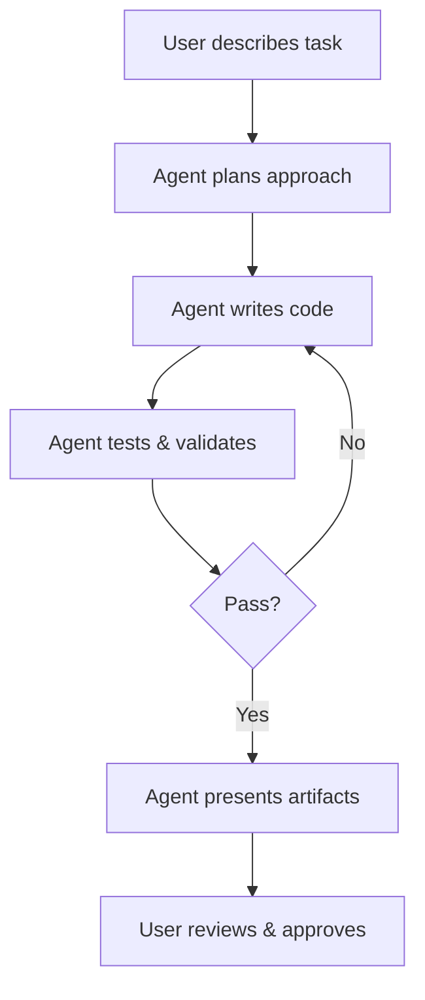

# AI Agents in Google Antigravity

## Agent-First Architecture

Google Antigravity is built around autonomous agents that can independently handle complex development tasks. Users describe what they want, and agents handle the planning, coding, debugging, and verification.

## How Agents Work



## Agent Capabilities

- **Code generation** — Write new files, functions, and modules
- **File editing** — Modify existing code across multiple files
- **Terminal commands** — Run builds, tests, and scripts
- **Browser interaction** — Test UIs, capture screenshots
- **Research** — Search the web for documentation and solutions
- **Planning** — Break complex tasks into manageable steps

## Task Groups

Group related tasks together to manage complex projects. Agents can work on multiple tasks within a group, sharing context and knowledge.

## Multi-Agent Coordination

Multiple agents can work in parallel on different aspects of a project, coordinated by the Agent Manager.

## Providing Feedback

You can guide agents mid-task by:

- Approving or rejecting proposed changes
- Providing additional context or constraints
- Pausing and resuming agent work
- Redirecting approach via feedback

## Advanced Techniques

### 🔄 Agent Chaining

Have one agent create scaffolding, another implement logic, and a third write tests. Chain their outputs for complex multi-phase workflows:

```
Agent 1 (Scaffold)  → creates file structure and interfaces
Agent 2 (Implement) → writes business logic across files
Agent 3 (Test)      → generates unit and integration tests
Agent 4 (Validate)  → runs tests and verifies coverage
```

### 📚 Knowledge Base

Agents maintain a knowledge base of useful patterns learned from past tasks:

- **Code snippets** — Reusable solutions to common problems
- **Architecture patterns** — Project-specific conventions
- **Debugging solutions** — Fix patterns for recurring issues
- **API patterns** — Endpoint naming, response formats

Manually save important patterns to ensure consistent application across sessions.

### 🎯 Model Selection

Different models excel at different task types:

| Task | Recommended Model | Why |
|---|---|---|
| General coding | Gemini 3 Pro | Balanced speed/quality |
| Fast iteration | Gemini 3 Flash | Low latency |
| Complex reasoning | Claude Sonnet 4.5 | Deep analysis |
| Creative solutions | GPT-OSS-120B | Alternative perspective |

Switch models per-task to optimize for your specific needs.

### 🔍 Iterative Refinement

After reviewing agent output, provide specific feedback and have the agent iterate. Each iteration builds better patterns:

1. Agent produces initial implementation
2. You review artifacts (code, screenshots, test results)
3. Provide targeted feedback: *"Use observer pattern instead of callbacks"*
4. Agent refines and re-validates
5. Repeat until satisfied

## Using the Agent Manager

### Spawning Agents

Create new agents from the Agent Manager panel. Each agent operates independently with its own context and task.

### Monitoring Progress

View real-time progress across all active agents. Each agent's artifacts update live, letting you spot issues early.

### Intervention Controls

- **Pause** — Temporarily halt an agent's execution
- **Resume** — Continue where the agent left off
- **Cancel** — Stop the agent and discard pending changes
- **Redirect** — Change the agent's approach mid-task

## See Also

- [Features](./features.md) — Complete feature overview
- [Best Practices](./best-practices.md) — Working effectively with agents
- [Skills Guide](./skills-guide.md) — Building custom agent behaviors
- [Browser Extension](./browser-extension.md) — Browser-based testing

