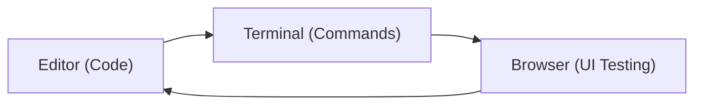

# Google Antigravity Features

## Agent Manager

The Agent Manager is Antigravity's "Mission Control" for orchestrating tasks and managing multiple autonomous agents. It provides:

- Task delegation and monitoring
- Multi-agent coordination
- Progress tracking via artifacts

## Editor View

A full-featured code editor (based on VS Code) with AI-native capabilities:

- Intelligent code suggestions
- Multi-file editing support
- Integrated terminal
- Browser subagent integration

## Artifacts & Verification

Agents generate transparent deliverables called **artifacts** to build trust:

| Artifact Type | Purpose |
|---|---|
| Task Lists | Track what needs to be done |
| Implementation Plans | Propose approach before coding |
| Screenshots | Visual proof of UI changes |
| Browser Recordings | Demonstrate user flows |
| Code Diffs | Show exactly what changed |

## Multi-Surface Integration

Agents operate across three surfaces:

## Browser Subagent

Agents can interact with a real browser for:

- UI testing and validation
- Screenshot capture
- Form interaction
- Navigation and data extraction

## Multi-Model Support

Antigravity supports multiple AI providers:

- **Gemini 3.1 Pro** — Primary model (generous free tier)
- **Gemini 3 Flash** — Fast, lightweight tasks
- **Claude Sonnet 4.6 / Opus 4.6** — Anthropic models
- **GPT-OSS-120B** — Open-source OpenAI variant

## Learning & Knowledge Base

Agents maintain a knowledge base of:

- Useful patterns and solutions
- Project-specific context
- Historical task outcomes

## Rules and Workflows

- **Rules:** Passive constraints governing agent behavior (e.g., "Always use TypeScript strict mode")
- **Workflows:** Active, user-triggered sequences for specific tasks

## Skills

Lightweight, open-format extensions that let you extend agent capabilities with specialized functionalities.

## See Also

- [Getting Started](./getting-started.md) — Installation and setup
- [Agents](./agents.md) — Deep dive into agent capabilities
- [Commands](./commands.md) — Editor and agent commands
