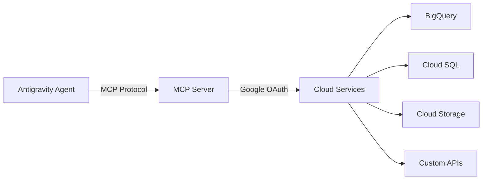

# MCP Integration

## What is MCP?

The **Model Context Protocol (MCP)** is an open standard that allows AI agents to securely connect to external data sources and tools. In Antigravity, MCP enables agents to interact with databases, APIs, and cloud services using your authenticated Google identity — no additional credentials required.

## How It Works



1. **Agent requests data** via the MCP protocol
2. **MCP server** authenticates using your Google session
3. **Cloud service** returns data through the secure connection
4. **Agent processes** the data as part of its task

## Supported Services

| Service | Capability | Auth Method |
|---|---|---|
| BigQuery | Query tables, analyze data | Google OAuth |
| Cloud SQL | Read/write database records | Google OAuth |
| Cloud Storage | Read/write files and blobs | Google OAuth |
| Firestore | Document database operations | Google OAuth |
| Custom REST APIs | Any HTTP endpoint | Bearer token |

## Setup

### Prerequisites

- Google Cloud project with billing enabled
- APIs enabled for the services you want to use
- Antigravity signed in with a Google account that has access

### Configuration

Add MCP servers to your Antigravity settings:

```json
{
  "mcpServers": {
    "bigquery": {
      "command": "npx",
      "args": ["-y", "@google/mcp-bigquery"],
      "env": {
        "GOOGLE_CLOUD_PROJECT": "your-project-id"
      }
    },
    "cloud-sql": {
      "command": "npx",
      "args": ["-y", "@google/mcp-cloud-sql"],
      "env": {
        "INSTANCE_CONNECTION_NAME": "project:region:instance"
      }
    }
  }
}
```

### Verify Connection

Ask the agent to query a simple dataset:

```
"List the tables in my BigQuery dataset 'analytics'"
```

If the connection is working, the agent will return the list of tables.

## Common Use Cases

### Data Analysis

```
"Query the sales table in BigQuery for Q1 2026 totals, 
 group by region, and create a summary chart"
```

The agent queries BigQuery via MCP, processes the results, and generates a visualization.

### Database Migrations

```
"Add a 'last_login' column to the users table in Cloud SQL"
```

The agent connects to your Cloud SQL instance, inspects the schema, generates the migration, and applies it.

### API Integration

```
"Fetch the latest deployment status from our internal API 
 and update the dashboard"
```

Custom MCP servers can wrap any REST API, giving agents access to internal tools.

## Security

> [!IMPORTANT]
> MCP uses your authenticated Google identity. Agents can only access services your Google account has permission for. No credentials are stored in code.

### Key Security Features

- **OAuth-based auth** — Uses your existing Google session
- **Scoped access** — Each MCP server declares what it can access
- **Audit logging** — All MCP requests are logged in the agent's artifacts
- **No credential storage** — Tokens are session-scoped, not persisted

### Best Practices

1. Use **least-privilege** IAM roles for your Google Cloud account
2. Enable **audit logging** on sensitive Cloud resources
3. Review MCP server packages before installing
4. Use **separate Google Cloud projects** for development and production

## Building Custom MCP Servers

You can create MCP servers for any data source:

```javascript
import { McpServer } from "@modelcontextprotocol/sdk/server/mcp.js";

const server = new McpServer({ name: "my-api" });

server.tool("get_status", "Get deployment status", {}, async () => {
  const response = await fetch("https://api.internal.com/status");
  const data = await response.json();
  return { content: [{ type: "text", text: JSON.stringify(data) }] };
});
```

## Troubleshooting

### MCP server not starting
- Verify `npx` is installed and in your PATH
- Check that the MCP package exists: `npm info @google/mcp-bigquery`
- Review Antigravity logs for connection errors

### Authentication failures
- Re-sign in to your Google account in Antigravity
- Verify your account has the required IAM permissions
- Check that the Cloud APIs are enabled in your project

### Slow queries
- BigQuery queries may take time for large datasets
- Consider using cached/materialized views for frequently accessed data
- Set query timeouts in the MCP server configuration

## See Also

- [Authentication](./authentication.md) — Google OAuth and sign-in
- [Features](./features.md) — Core platform capabilities 
- [Getting Started](./getting-started.md) — Initial setup
